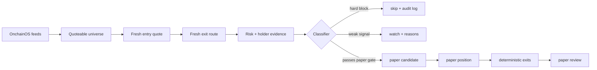

# Quoteable Smart-Money Meme Scout

An OnchainOS-first meme trading Skill for the OKX Agentic Wallet competition. It does one thing well: **find tokens that are actually quoteable, explain why they pass or fail, and only then allow paper trading.**

This package is the clean submission surface for TraderV. It deliberately leaves the private research lake, historical strategy search, teacher models, Telegram router, and private credentials outside the Skill.

## One Page Pitch

| Area | What The Skill Does |
|---|---|
| Discovery | Builds an OnchainOS-first universe from hot tokens, smart-money signals, and meme-pump sources. |
| Execution realism | Requires fresh entry quote, fresh exit route, slippage bounds, and quote age checks before paper open. |
| Risk control | Blocks OKX risk level 3+, security warnings, stable/native/wrapped routes, active paid promotion, high bundler, high holder concentration, and weak liquidity. |
| Agent behavior | The agent can classify `skip`, `watch`, or `paper_candidate`; it cannot bypass hard risk gates. |
| Observability | Every decision writes candidate evidence, quote evidence, risk evidence, paper ledger rows, and a review. |
| User safety | No wallet export, no private-key handling, no live swap in v1. |
| Live evidence | Supports operator-in-the-loop evidence reports for user-confirmed Agentic Wallet trades. |

The product philosophy is intentionally conservative: **no fresh quote, no route, no paper trade.**

## Why It Fits The Competition

- **Strategy completeness:** discovery, scoring, quote check, risk gate, paper open, exit, and review are covered end to end.
- **Risk framework:** hard blocks and deterministic exits are explicit, not hidden in prompt text.
- **Execution reliability:** paper entries use quote evidence instead of stale snapshot prices.
- **User safety:** v1 is paper-first and never asks for wallet export or private keys.
- **Observability:** reviewers can inspect every skip, warning, paper entry, and close reason.
- **Live evidence without unsafe automation:** real Agentic Wallet trades can be journaled as operator-confirmed evidence without giving the Skill signing power.
- **Observed competition evidence:** the attached operator-in-the-loop snapshot records wallet equity growth from about `$500.00` to `$793.70` (`+58.7%` equity return) and leaderboard realized PnL of about `+$167.71` (`+33.5%` on the same starting-capital reference), with observed qualifying volume above `$1,900`.
- **Operator control:** operator-in-the-loop live evidence can be attached from user-confirmed Agentic Wallet competition trades. The Skill records risk cards, token addresses, route evidence, and realized PnL, while the user retains execution control.

## 90 Second Demo

Run the offline demo. It does not call OnchainOS, sign transactions, broadcast transactions, or use private data.

```bash
git clone https://github.com/V-SK/quoteable-smart-money-meme-scout.git
cd quoteable-smart-money-meme-scout
python3 scripts/validate_skill_package.py .
python3 scripts/run_demo.py --output-dir /tmp/traderv-skill-demo
```

Open the demo summary:

```bash
sed -n '1,220p' /tmp/traderv-skill-demo/demo_dashboard.md
```

Generated demo artifacts:

- `demo_dashboard.md` - reviewer-friendly one-page dashboard.
- `candidate_report.json` - ranked skip/watch/paper candidates.
- `pre_trade_risk_card.md` - compact operator risk card before a user-confirmed trade.
- `live_evidence_report.md` - example operator-in-the-loop live evidence report.
- `risk_audit_log.jsonl` - hard blocks and warnings.
- `paper_trade_ledger.jsonl` - simulation-only paper lifecycle.
- `paper_trade_review.json` - post-trade review with MFE/MAE and quote quality.
- `summary.md` - compact human summary.

## Private Lab Smoke Test

The public repository is a clean review package. It does not include the private TraderV research lake, Telegram router, local API credentials, or historical strategy-search backend.

Inside the private TraderV lab, the same Skill surface can be connected to report-only OnchainOS read-only collectors like this:

```bash
python3 scripts/build_onchainos_quoteable_universe.py --source-limit 50 --limit 50 --quote-ladder 5,10 --check-exit-route --write-report
python3 scripts/enrich_quoteable_universe_evidence.py --limit 30 --write-report
python3 scripts/build_competition_micro_candidates.py --source quoteable_universe --limit 30 --refresh-first --refresh-top-n 30 --quote-ladder 5,10 --check-exit-route --write-report
python3 scripts/run_quote_paper_sampler.py --source quoteable_universe --candidate-set paper_micro_candidate --jit-quote-open --max-new 1 --limit 30 --dry-run
```

Those private-lab commands are not required for review. They are shown to explain how the submission package maps to the broader report-only research backend. The last command is a dry run. It must not sign, broadcast, or live swap.

## Architecture



## Command Surface

Natural-language commands supported by the Skill:

| Command | Result |
|---|---|
| `scan market` | Build quoteable universe from OnchainOS sources. |
| `show candidates` | Show top skip/watch/paper candidates and reasons. |
| `paper trade top candidate` | Open a simulation-only paper position if quote and risk checks pass. |
| `show risk report` | Summarize hard blocks, soft warnings, and evidence coverage. |
| `show positions` | Show open and closed paper positions. |
| `explain decision` | Explain score, quote, risk, blockers, and exit plan for one token. |
| `prepare live risk card` | Produce a pre-trade risk card for an operator-confirmed Agentic Wallet trade. |
| `record live result` | Journal a user-confirmed live trade result without storing secrets or signing. |

## Safety

- Default mode: `paper`.
- Live trading: disabled in v1.
- Future live execution route: OKX Agentic Wallet / OnchainOS only.
- Secrets: no API keys, Telegram tokens, private keys, mnemonics, or wallet exports.
- Reporting: Telegram is optional report-only output, not a trade confirmation channel.

Hard skips include OKX risk level 3+, blocked security scans, stable/native/wrapped-native routes, active paid promotion, stale quotes, unavailable routes, excessive slippage, and insufficient liquidity.

## Outputs

`candidate_report.json` includes chain, token address, quote evidence, risk evidence, blockers, score, and recommended action.

`pre_trade_risk_card.md` gives the operator a compact go/no-go card before a user-confirmed trade.

`paper_trade_ledger.jsonl` records simulation-only paper events. It never represents live fills.

`operator_live_trade_journal.jsonl` is an optional evidence log for trades manually confirmed by the user in Agentic Wallet. It is not an execution engine.

`risk_audit_log.jsonl` records every hard block and soft warning.

`paper_trade_review.json` records entry thesis, exit reason, MFE/MAE, quote quality, liquidity quality, and lessons.

`live_evidence_report.md` summarizes operator-in-the-loop live evidence, such as realized PnL, eligible volume status, and safety notes.

`evidence/live_evidence_report.real.md` may be attached for the current competition run. It separates wallet-equity return from leaderboard realized PnL so the submission is stronger without overstating the official PnL metric.

Real review evidence may be attached under `evidence/` when sourced from user-confirmed Agentic Wallet competition trades. These artifacts must remain operator-in-the-loop, mark `skill_live_trading=false`, redact tx hashes where required, and state that the Skill did not sign or broadcast.

## Future Live Mode

Live mode is intentionally not enabled. A future version must add a separate explicit live design, pass compliance checks, require user approval, and keep Agentic Wallet / OnchainOS as the only execution route.
