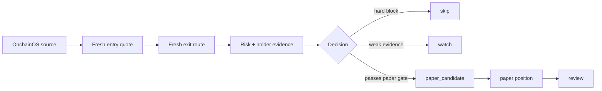

# Quoteable Smart-Money Meme Scout Demo Dashboard

Mode: `paper_only`  
Live trading: `OFF`  
Wallet signing: `OFF`  
Primary source: `OnchainOS`

## Reviewer Snapshot

| Metric | Demo Value |
|---|---:|
| Candidates reviewed | 3 |
| Paper candidates | 1 |
| Watch candidates | 1 |
| Hard skips | 1 |
| Fresh entry route required | yes |
| Fresh exit route required | yes |
| Private-key handling | forbidden |
| Operator live evidence | supported, user-confirmed only |

## Candidate Board

| Rank | Symbol | Action | Score | Quote | Risk | Why It Matters |
|---:|---|---|---:|---|---|---|
| 1 | QSM | paper_candidate | 86 | entry+exit ok | level 1 | Quoteable smart-money sample with clean holder/risk evidence |
| 2 | WATCH | watch | 61 | entry+exit ok | level 2 | Needs stronger holder and wallet-flow confirmation |
| 3 | BLOCK | skip | 0 | no route | level 3 | Risk and active promotion hard block |

## Decision Flow

## Paper Review Example

| Field | Value |
|---|---:|
| Position | demo-001 |
| Exit reason | time_stop |
| Simulated return | +8.4% |
| MFE / MAE | +13.2% / -2.1% |
| Mark source | fresh_exit_quote |
| Live execution | false |

## Operator-In-The-Loop Live Evidence

| Field | Value |
|---|---|
| User-confirmed live trade journal | supported |
| Skill signs transactions | false |
| Skill broadcasts transactions | false |
| Evidence report | `live_evidence_report.md` |

## Safety Promise

The demo does not call OnchainOS, does not sign transactions, does not broadcast transactions, and does not use private data. It exists to show the Skill's decision surface and audit trail.
